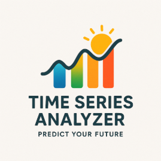

<div align="center">

  

  # 🌡️ Time Series Temperature Forecasting & Analytics

  *An interactive end-to-end Machine Learning web dashboard to visualize, evaluate, and forecast hourly temperatures across multiple urban regions.*

  [](https://parinbajayebin-time-series-forecasting-streamlit-app-atuar6.streamlit.app/)
  [](https://www.python.org/)
  [](https://streamlit.io/)
  [](https://plotly.com/)
  [](LICENSE)

  [**🚀 Launch Live Web App**](https://parinbajayebin-time-series-forecasting-streamlit-app-atuar6.streamlit.app/) • [**📖 Explore Jupyter Notebooks**](#-project-structure) • [**⚡ Quick Start**](#-getting-started)

</div>

---

## 🌟 Key Highlights

- 🎯 **Multi-Region Coverage**: Hourly micro-climate temperature tracking for key regions: **Rakhiyal, Bopal, Ambawadi, Chandkheda,** and **Vastral**.
- 📊 **Dynamic Model Benchmarking**: Auto-detects trained time series forecasting models and computes real-time **RMSE (Root Mean Squared Error)** comparison matrices.
- 🔮 **2025 Out-of-Sample Forecasting**: Interactive model-to-model predictions for upcoming unseen 2025 climate timelines.
- ⚡ **Interactive Visualization**: Powered by Plotly line charts, sidebar controls, date filters, and comparison toggles.

---

## 📸 Dashboard Preview & Features

<div align="center">
  
</div>

> [!NOTE]  
> The dashboard dynamically scans pre-computed prediction outputs inside `csvs_extracted/data/` to compare model metrics seamlessly without compute latency.

### 1. 📅 2024 Forecast & Actuals
- Filter hourly forecasts by model, region, month, and specific day of the month.
- Toggle between **Predicted Temperature** and **Actual Recorded Temperature** overlays.

### 2. 📊 Actual vs. Predicted Model Comparison
- Side-by-side model curve overlay for any selected day.
- **Region-wise RMSE Summary Table** evaluating accuracy score across all 5 test zones.

### 3. 🔮 2025 Unseen Forecast & Model Comparison
- Out-of-sample future predictions for 2025.
- Integrated **"Compare Models"** feature to benchmark predictions across different algorithms for the exact same window.

---

## 📁 Project Structure

```text
time-series-forecasting/
├── .devcontainer/               # VS Code Dev Container configuration
├── csvs_extracted/
│   └── data/                    # Model output CSV datasets & metric summaries
│       ├── *_model_metrics_2024.csv
│       ├── *_rakhiyal_2024.csv
│       └── ...
├── models/                      # Saved machine learning checkpoints & pickle files
├── logo.png                     # Static brand logo
├── logo_gif.gif                 # Animated visual asset
├── requirements.txt             # Python dependencies
└── streamlit_app.py             # Main Streamlit web application entry point
```

---

## 🛠️ Tech Stack & Dependencies

- **Language**: Python 3.9+
- **Frontend / Web Framework**: [Streamlit](https://streamlit.io/)
- **Data Manipulation**: [Pandas](https://pandas.pydata.org/), [NumPy](https://numpy.org/)
- **Data Visualization**: [Plotly Express](https://plotly.com/python/plotly-express/)
- **Modeling**: Jupyter Notebooks (Prophet, ARIMA/SARIMAX, Machine Learning & Deep Learning architectures)

---

## ⚡ Getting Started

### 1. Prerequisites
Ensure you have **Python 3.9 or higher** installed.

### 2. Clone the Repository
```bash
git clone https://github.com/parinbajayebin/time-series-forecasting.git
cd time-series-forecasting
```

### 3. Install Dependencies
```bash
pip install -r requirements.txt
```

### 4. Run the Streamlit Application
```bash
streamlit run streamlit_app.py
```

The web dashboard will automatically open in your default browser at `http://localhost:8501`.

---

## 📊 Regions Covered

| Region | Category | Coordinates / Focus |
| :--- | :--- | :--- |
| 📍 **Ambawadi** | Urban Commercial | Central Node |
| 📍 **Bopal** | Suburban Residential | West Zone |
| 📍 **Chandkheda** | Industrial / Residential | North Zone |
| 📍 **Rakhiyal** | Industrial Hub | East Zone |
| 📍 **Vastral** | High Density Residential | South-East Zone |

---

## 👥 Contributing

Contributions, issues, and feature requests are welcome!  
Feel free to check out the [issues page](https://github.com/parinbajayebin/time-series-forecasting/issues).

---

## 📜 License

This project is licensed under the [MIT License](LICENSE).

<div align="center">
  <sub>Built with ❤️ by <a href="https://github.com/parinbajayebin">Parin Bajayebin</a></sub>
</div>
